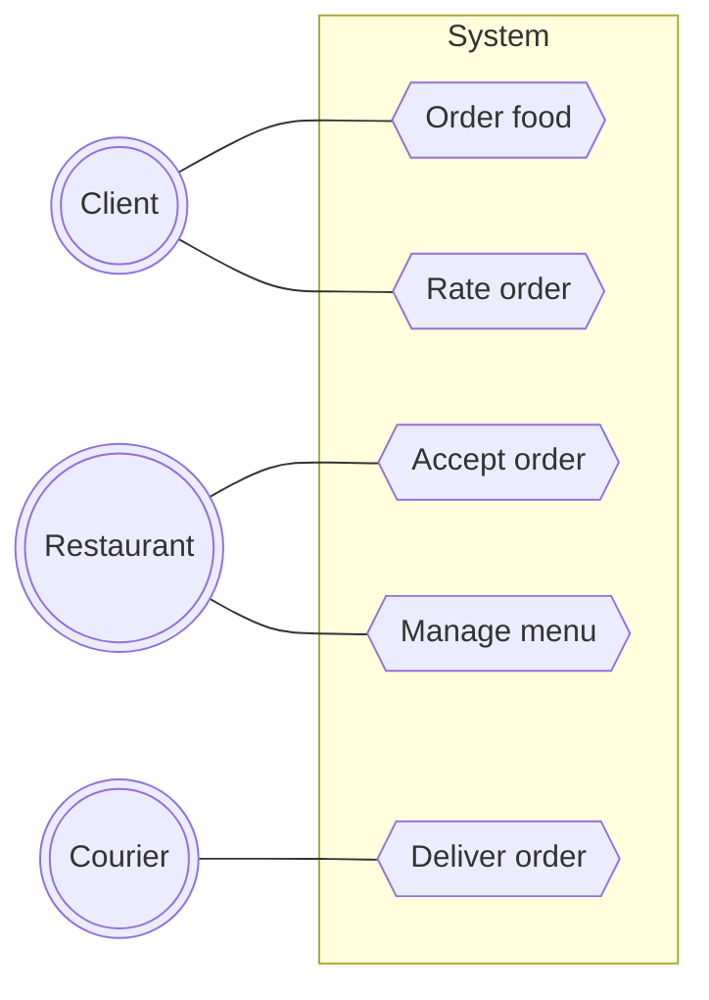
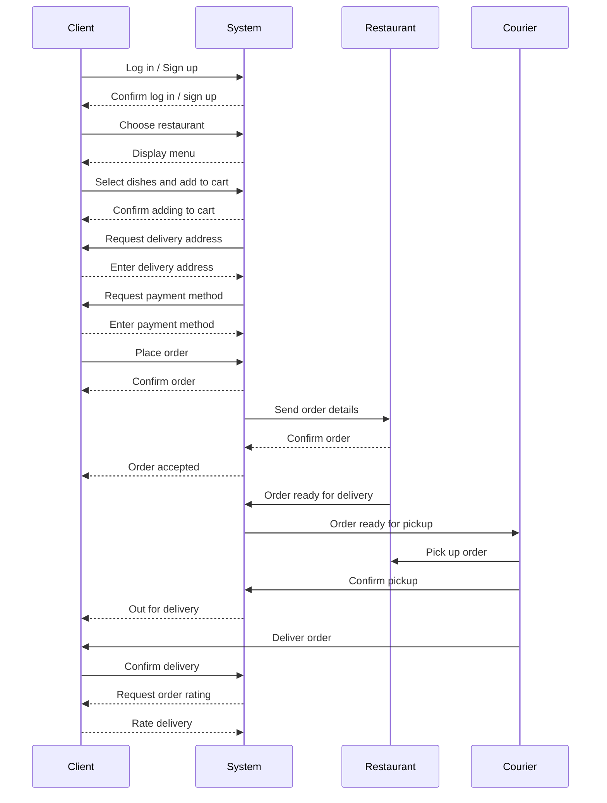
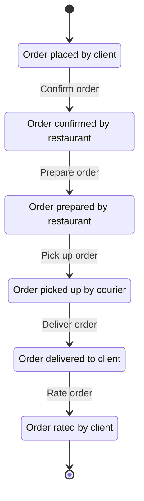
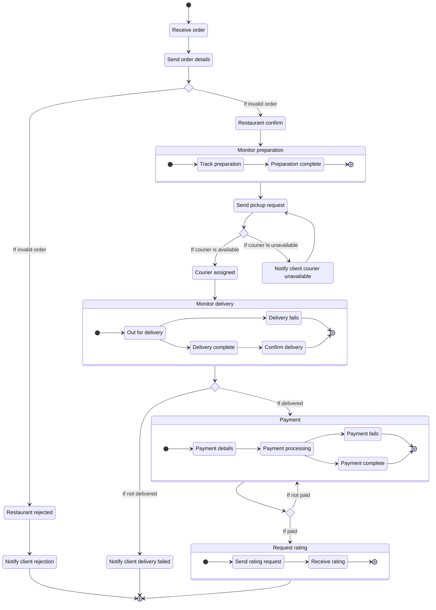
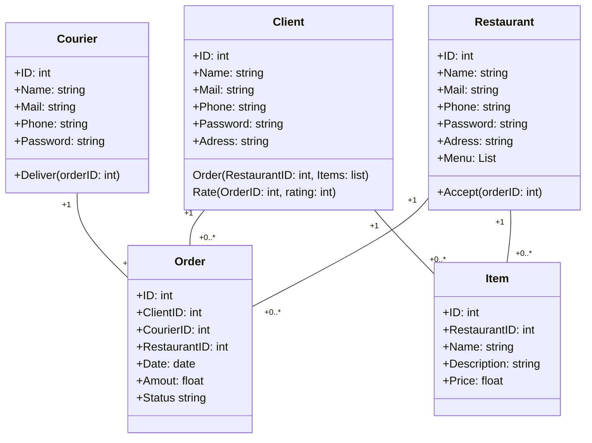

## Description

Система доставки еды представляет собой онлайн-платформу, которая обеспечивает пользователей возможность заказа еды из различных ресторанов и доставку заказов курьерами. Она предоставляет удобный и эффективный способ для клиентов заказывать блюда из различных заведений, а также для ресторанов и курьеров эффективно управлять заказами и доставкой.

- **Регистрация и аутентификация**: Пользователи могут зарегистрироваться в системе как клиенты, рестораны или курьеры, указав необходимую информацию, такую как имя, адрес электронной почты и номер телефона. После регистрации они могут аутентифицироваться для доступа к своим аккаунтам.
- **Заказ еды**: Клиенты могут просматривать меню ресторанов, выбирать блюда и оформлять заказы через веб-интерфейс или мобильное приложение. Они могут указать адрес доставки и способ оплаты.
- **Управление заказами**: Рестораны получают уведомления о новых заказах и могут принимать или отклонять их. Они могут отслеживать статусы заказов и готовить блюда для доставки. Курьеры получают уведомления о заказах, которые им назначены, и могут подтверждать их доставку. Они могут отслеживать маршруты доставки и информировать клиентов о статусе доставки.
- **Оплата и оценка**: После доставки заказа клиент может оплатить его через платформу. Клиент также может оценить качество обслуживания и оставить отзыв о заказе.

## Use case diagram

## Sequence diagram

## State diagram

## Activity diagram

## Class diagram

